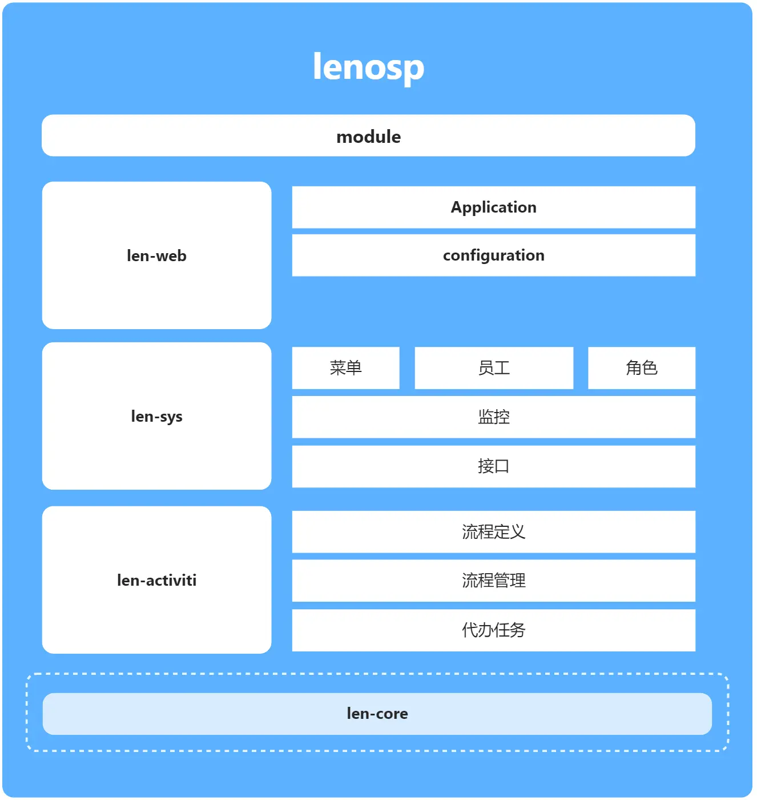

# 郑州程序员群

# 重要重要通知：强烈欢迎你的参与和贡献，保姆式引导你参与lenosp项目开源，联系组织管理，感兴趣的话非常欢迎你的加入，技术无所谓。真真的！！

	👉 <a target="_blank" href="http://42.192.219.164">http://42.192.219.164</a>👈|admin|123456

	
        
        
        

# 简介

lenosp是一个基于spring boot的脚手架，并提供完善社区文档教程，中小企业可以用来快速迭代。

您可以阅读文档快速部署上手：
 <a target="_blank" href="https://www.kancloud.cn/zhuxm/zzdevelop/content">
     **社区文档** 
</a>
 <a target="_blank" href="https://www.kancloud.cn/zhuxm/zzdevelop/3142792">
    **项目模块介绍** 
</a>
 <a target="_blank" href="https://www.kancloud.cn/zhuxm/zzdevelop/3142806">
     **本地开发部署教程** 
</a>
 <a target="_blank" href="https://www.kancloud.cn/zhuxm/zzdevelop/3143263">
     **工具集** 
</a>

# 体验

[http://42.192.219.164/login](http://42.192.219.164/login)
体验账户：admin，所有账户密码：123456
测试环境，所有业务增删改不会持久化，默认显示成功

# 模块

# 里程碑

完善当前单体应用，趋于稳定，可供中小企业快速迭代。
- 代码风格约束
- 完善注释
- 模块划分调整
- bug&漏洞、pom升级
- 前端优化
- 通用代码生成功能
- 文档工具集教程
- 安装部署教程
- pom版本抽离
- 接口返回值完善封装
- 模块(maven)命名合理性
- 前端js方法、封装

# 关于我们

本项目是郑州程序员组织成员开发迭代

# 加入开源组织

# 社区

文档地址：https://www.kancloud.cn/zhuxm/zzdevelop/3141950